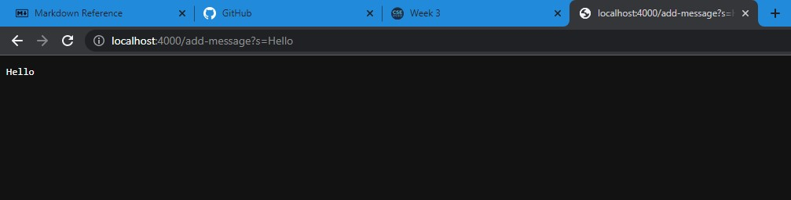
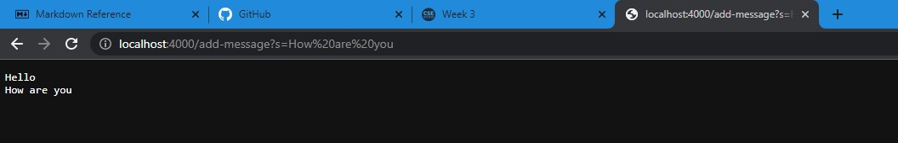
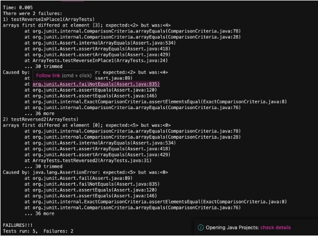

# Lab report 2: 
---
**StringServer.java**

`import java.io.IOException;
import java.net.URI;
import java.util.*;`

`class Handler implements URLHandler {`
` List<String> a = new ArrayList<>();`

`String rs = "";`
    
    `public String handleRequest(URI url) {`
        if (url.getPath().equals("/")) {
            rs = "";
            for(String x : a){
                rs += x;
                rs += "\n";
            }
            return rs;
        }
        else if(url.getPath().contains("/add")){
            System.out.println("Path: " + url.getPath());
            String[] parameters = url.getQuery().split("=");
            if(parameters[0].equals("s")){
                rs = ""; 
                a.add(parameters[1]);
                for(String x : a){
                    rs += x;
                    rs += "\n";
                }
                return rs;
            }
            else{ return "404 not found";}

        }
    else if(url.getPath().equals("/clear")){
        rs =  "";
        a.removeAll(a);
        return "Words cleared.";
    }
    else{
        return "404 not found";
    }
`}`
`}`
`class StringServer{`

    `public static void main(String[] args) throws IOException{`
        if(args.length == 0){
            System.out.println("Missing port number! Try any number between 1024 to 49151");
            return;
        }
        int port = Integer.parseInt(args[0]);

        Server.start(port, new Handler());
    }
}`
 
**Part 1:**

 using `/add-message` screenshots: 
 
 
 
 
 
 In the first screenshot, the method handlerequest is called with /add-message?s= as the argument, which then adds the word after the = sign, which is Hello. In the second screenshot, handlerequest is called twice as the first time was with hello and the second time was with how are you. When I added the second message, it was saved into the "a" arraylist and then added to "rs", and then broke them into two lines due to "\n". Values of any relevant fields of the class change into a string value, as the method returns any inputted values back as a string and prints them out on the page. More specifically, the handle method of the Handler class is called with the URI of the request as the argument. It then checks for what the path has in it, whether it is a /, /add or /clear. If the path contains "/add", the handle method obtains the string that is to be added from the path and adds it to the page. It does this by using the handle method, which uses the query() method to get the query part of the string of the URI. the getQuery() method then returns a string that is split using split(), which is then added using a.add(parameters[1]). If the path contains "/clear" then the arraylist is cleared and will display "words cleared".
 
**Part 2:**

The reversed() method in lab 3 was buggy and did not work in its intended way. 

Failure inducing input: 

`@Test`

   `public void testReversed2() {`
   
        `int[] arr = {1,2,3,4,5};
        int[] reversed = ArrayExamples.reversed(arr);
        aasertArrayEquals(new int[] {5,4,3,2,1}, reversed);
    }`

Working input:

` @Test`

   `public void testReversed(){`
   
   `int[] input = { };`
        
        assertEquals(new int[]{ }, ArrayExamples.reversed(input1));
    }`

Output of tests: 

The working input only worked because the input was empty, meaning that the reversed method would pass since there was nothing to reverse. Conversely, the failure inducing input failed because the method was simply copying the numbers into the inputted int list. 

**The Fix**

Reversed() before: 

 `static int[] reversed(int[] arr){`
 
        int[] newArray = new int[arr.length];
        for(int i =0; i<arr.length; i+=1){
            arr[i] = newArray[arr.length-i-1];
        }
        return arr; 
    }`

Reversed() after:

`static int[] reversed(int[] arr){`

        int[] newArray = new int[arr.length];
        for(int i =0; i<arr.length; i+=1){
            newArray[i] = arr[arr.length-i-1];
        }
        return newArray; 
    }`

The bug in the original code was that the loop was assigning the wrong elements of newarray to arr array. This is due to the incorrect indexing, arr[i] = newArray[arr.length-i-1]. By switching arr and newArray, the fixed method creates a new empty list and copies the elements in the argument in reverse order. More specifically, the code was swapping the front element in the array without swapping the end element, causing the front to stay the same. With the change, the original array is all reversed first before being inputted into the newArray. 

**Part 3:**

In lab two I learned that github desktop tracks and records changes then pushes them out to Github. Previously I thought of it as a more convienient IDE, one that would let me code and push to github in the same app, but now I know it solely serves the purpose of tracking, recording, then pushing. 

