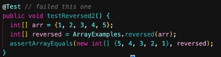
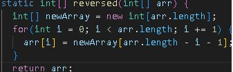
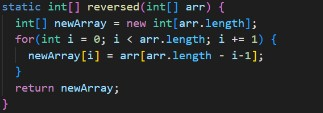

# Lab report 2: 
---
**Part 2:**

The reversed() method in lab 3 was buggy and did not work in its intended way. 

Failure inducing input: 

Working input:

The working input only worked because the input was empty, meaning that the reversed method would pass since there was nothing to reverse. Conversely, the failure inducing input failed because the method was simply copying the numbers into the inputted int list. 

**The Fix**

Reversed() before: 

Reversed() after:

Now, the fixed method creates a new empty list and copies the elements in the argument in reverse order.

**Part 3:**

In lab two I learned that github desktop tracks and records changes then pushes them out to Github. Previously I thought of it as a more convienient IDE, one that would let me code and push to github in the same app, but now I know it solely serves the purpose of tracking, recording, then pushing. 

