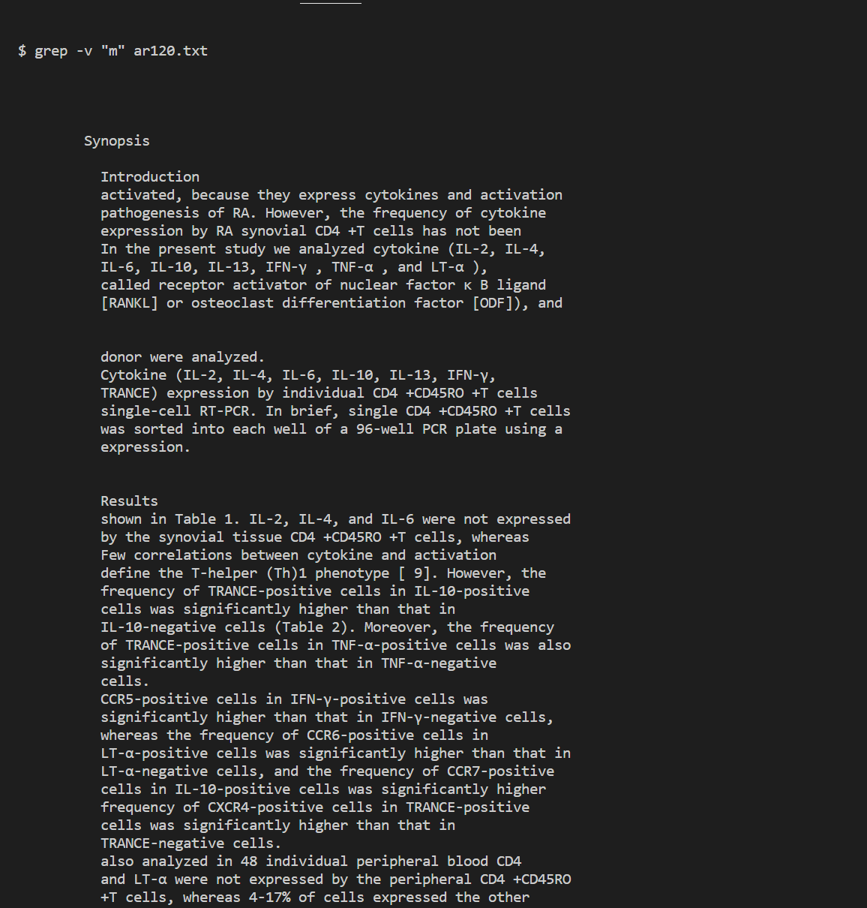
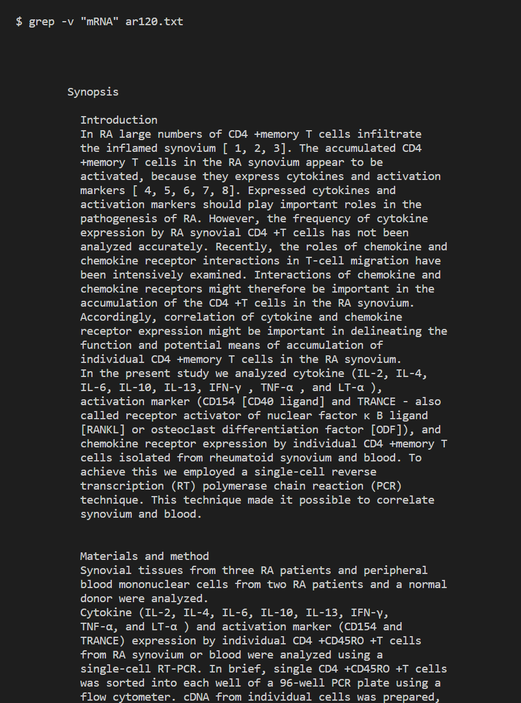
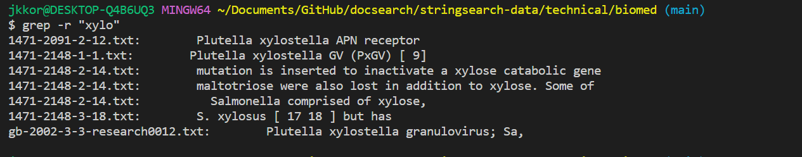
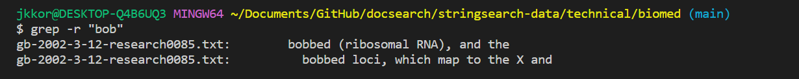
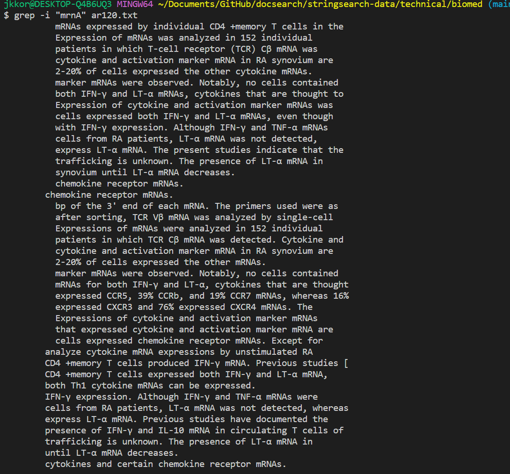
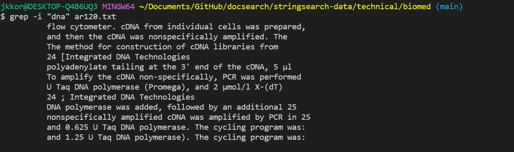
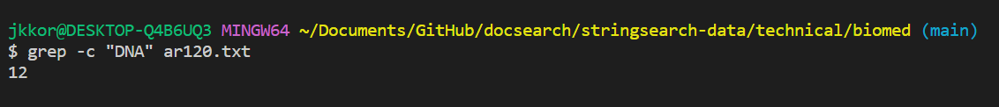

# Lab report 3: 
---
### grep Commands
1. `grep -v`
    1. Example: 
        `grep -v "m" ar120.txt`
        
        `grep -v "mRNA" ar120.txt`
    2. Output1: 
      
      
    4. Output2:
      
      
    6. Explanation: 
The command shows all lines in the directed .txt file (in this case ar120) that don't include the word in the quotes, as seen from each output with their corresponding words bio and mRNA respectively. This is useful in any scenario where you are trying to find information in the file and desire to remove certain lines to make your search easier through the process of elimination. 
       
3. `grep -r`
    1. Example:
       `grep -r "xylo"`
       
       `grep -r "bob"`
    2. Output1:
      
      
    4. Output2:
      
      
    6. Explanation:
The command looks for the lines that contain the word in the quotes, any string between two quotation marks after typing grep -r in the terminal, in the .txt file or given directory, as well as any patterns within the file. This could be useful for directly locating any information that is being searched for within the file. In both outputs we see how the inputted word, in these cases xylo and bob, are contained in the files that are returned after the command is inputted. Both words were identified within the returned files. 
5. `grep -i`
    1. Example:
       `grep -i "mrna"`
       
       `grep -i "dna"`
    2. Output1:
       
       
    4. Output2:
       
       
    6. Explanation:
The command looks for lines that contain the desired word that one may look for, regardless of capatilization, allowing them to find all instances of the word. This could be useful for searching for a word but you don't know if it capatilized or not in the file, or if there are incorrect capitalizations, allowing you to find the word regardless. 
7. `grep -c`
    1. Example:
       `grep -c "mRNA" ar120.txt`
       
       `grep -c "DNA" ar120.txt`
    2. Output1:
       
       
    4. Output2:
       
       
    6. Explanation: 
The grep -c command is used to count the number of lines that match a pattern in a file. It is useful when you want to know how many times a particular pattern appears in a file, without displaying the actual matching lines.

## Sources:
In the instructions, it says to consider asking chatGPT so I thought I'd test its usefulness for myself. To my surprise, I asked for 4 different grep commands and it provided me with multiple, also giving an explanation and examples for each command. In my opinion, it is even easier than asking google as there is no need to find a resource since ChatGPT simply outlays all the needed information for you in one place.

      

